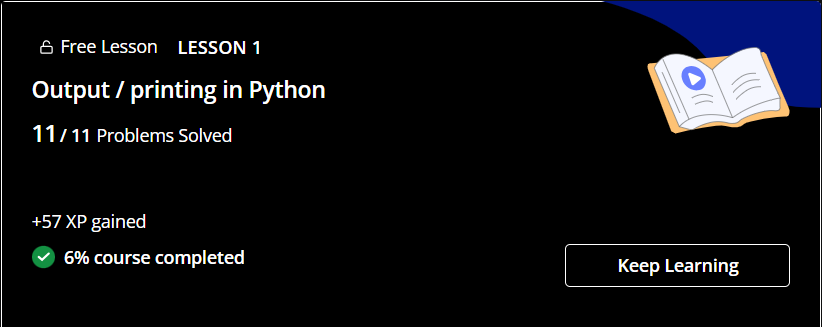

-> Task 3: Coding & Collaborative Tools  

   Part A: Coding Tools  

   Platform Used: HackerEarth  
   
     
   
   
   Part B: Digital Literacy Quiz  
   
   Platforms Used: Google Forms, Google Sheets  
   
   1. Digital Literacy Awareness Quiz  
   
     
   
   2. Attached Google Sheet for Data Collection  
   
   
